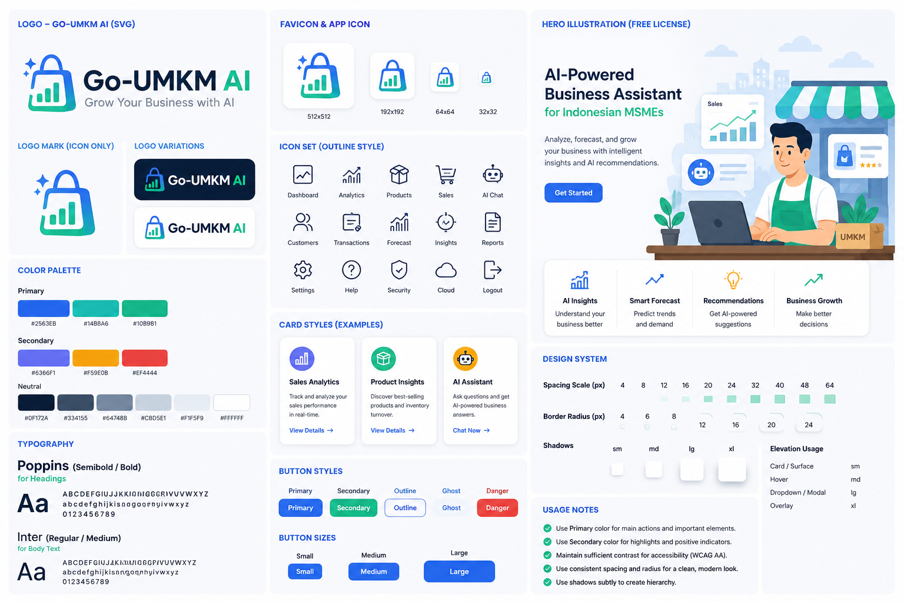

# Go-UMKM AI 🤖

### Grow Your Business with AI

<p align="center">
  
</p>

**Go-UMKM AI** adalah aplikasi SaaS berbasis AI yang dirancang untuk membantu
**Usaha Mikro, Kecil, dan Menengah (UMKM) Indonesia** mengelola bisnis secara
lebih cerdas, praktis, dan berbasis data.

Aplikasi ini membantu pelaku UMKM untuk mencatat transaksi, mengelola produk,
membaca insight bisnis, membuat konten pemasaran, mengekspor laporan, dan
berinteraksi dengan **AI Business Assistant** untuk mendukung pengambilan
keputusan.

Go-UMKM AI bukan sekadar chatbot. Aplikasi ini dibangun sebagai
**AI-powered business assistant** dengan arsitektur berlapis, business context,
workflow orchestration, analytics, dan dukungan Multi-LLM.

---

## 🚀 Fitur Utama

### 1. Dashboard Bisnis

Dashboard menampilkan ringkasan bisnis harian dalam satu workspace, antara lain:

- pendapatan / revenue,
- pengeluaran / expenses,
- laba / profit,
- cash flow,
- performa produk,
- transaksi terbaru,
- sinyal kesehatan bisnis,
- dan quick actions untuk operasional harian.

### 2. Manajemen Transaksi

Pengguna dapat:

- mencatat transaksi penjualan,
- melihat riwayat transaksi,
- memantau status transaksi,
- dan membaca data penjualan untuk kebutuhan analisis bisnis.

### 3. Manajemen Produk

Pengguna dapat:

- melihat katalog produk,
- memantau stok,
- membaca sinyal produk aktif,
- mengenali produk stok rendah,
- mengidentifikasi produk stok habis,
- dan meninjau performa produk.

### 4. AI Business Assistant

AI Business Assistant dapat membantu menjawab pertanyaan bisnis seperti:

- produk apa saja yang dijual?
- produk apa yang terjual?
- produk paling laku?
- produk kurang laku?
- produk yang belum terjual?
- stok apa yang menipis?
- bagaimana kesehatan bisnis hari ini?
- alert apa yang perlu diperhatikan?
- margin produk mana yang tinggi atau rendah?

Untuk sejumlah pertanyaan bisnis, sistem dapat menjawab langsung dari business
context tanpa selalu bergantung pada provider AI eksternal.

### 5. Marketing Workspace

Pengguna dapat:

- membuat ide campaign,
- menulis caption promosi,
- menyimpan riwayat campaign,
- memilih product context,
- dan menerima rekomendasi pemasaran berdasarkan data produk dan bisnis.

### 6. Insights Workspace

Pengguna dapat:

- membuat insight bisnis,
- menyimpan rekomendasi,
- memilih kategori insight,
- membaca sinyal bisnis,
- dan meninjau rekomendasi tindakan berdasarkan konteks bisnis.

### 7. Export Center

Pengguna dapat menyiapkan dan mengekspor laporan bisnis untuk kebutuhan
monitoring, evaluasi, dan analisis lanjutan.

---

## 🧠 Kapabilitas AI

Go-UMKM AI memiliki dua lapisan kecerdasan utama.

### A. Local Business Intelligence Layer

Layer ini membaca data bisnis lokal dan business context untuk menjawab
pertanyaan operasional secara cepat dan deterministik.

Contoh intent yang didukung:

- Product Catalog,
- Best Selling Product,
- High Revenue Product,
- Slow Moving Product,
- Zero Sales Product,
- Out of Stock,
- Low Stock,
- Overstock,
- High Margin Product,
- Low Margin Product,
- Business Health,
- Alert Summary,
- Follow Up,
- Greeting,
- Business Identity.

### B. Multi-LLM Provider Layer

Untuk kebutuhan generatif, penjelasan naratif, dan respons AI lanjutan, sistem
mendukung arsitektur **Multi-LLM** dengan failover otomatis.

Urutan prioritas provider:

1. Gemini,
2. OpenRouter,
3. Hugging Face,
4. OpenAI opsional,
5. Ollama opsional.

Jika satu provider gagal karena quota, rate limit, timeout, HTTP 5xx, atau
gangguan sementara, sistem dapat mencoba provider berikutnya.

---

## 🏗 Arsitektur Proyek

Arsitektur aplikasi mengikuti pola berlapis berikut:

```text
Repository
    ↓
Service
    ↓
Tools
    ↓
Workflow
    ↓
Agent
    ↓
FastAPI
    ↓
Streamlit Frontend
```

### Penjelasan Singkat

| Layer | Peran |
|---|---|
| Repository | Akses database dan operasi data dasar |
| Service | Logika layanan per domain |
| Tools | Fungsi bisnis, analytics, dan operasi pendukung |
| Workflow | Orkestrasi alur kerja bisnis |
| Agent | Routing intent dan pengambilan keputusan domain |
| FastAPI | Backend API contract |
| Streamlit | Frontend dan user interface |

Prinsip utama proyek:

- separation of concerns,
- dependency injection,
- testability,
- maintainability,
- clean architecture,
- backward compatibility,
- dan struktur yang siap dikembangkan sebagai SaaS.

---

## 🧰 Technology Stack

| Layer | Teknologi |
|---|---|
| Frontend | Streamlit |
| Backend API | FastAPI |
| Database | Supabase |
| AI Provider | Gemini, OpenRouter, Hugging Face, OpenAI opsional, Ollama opsional |
| Validation | Pydantic |
| Analytics | Python |
| Logging | Loguru |
| Environment | python-dotenv |
| Testing | Pytest |
| Linting | Ruff |
| Deployment Target | Render, Streamlit Community Cloud, atau platform sejenis |

---

## 📁 Struktur Proyek

```text
umkm-copilot-ai/
│
├── app.py
├── requirements.txt
├── pyproject.toml
├── README.md
├── .env.example
│
├── app/
│   ├── agents/
│   ├── analytics/
│   ├── api/
│   ├── config/
│   ├── database/
│   ├── frontend/
│   ├── llm/
│   ├── memory/
│   ├── repositories/
│   ├── schemas/
│   ├── services/
│   ├── tools/
│   ├── utils/
│   └── workflows/
│
├── pages/
├── docs/
├── prompts/
├── scripts/
├── storage/
└── tests/
```

---

## ⚙️ Instalasi Lokal

### 1. Clone repository

```bash
git clone <repository-url>
cd umkm-copilot-ai
```

### 2. Buat virtual environment

```bash
python -m venv .venv
```

### 3. Aktifkan virtual environment

Linux / macOS:

```bash
source .venv/bin/activate
```

Windows:

```bash
.venv\Scripts\activate
```

### 4. Install dependency

```bash
pip install -r requirements.txt
```

---

## 🔑 Environment Variables

Buat file `.env` berdasarkan `.env.example`.

Contoh konfigurasi lokal:

```env
APP_ENV=development
APP_DEBUG=false
LOG_LEVEL=INFO

SUPABASE_URL=https://your-project.supabase.co
SUPABASE_KEY=your-supabase-secret-or-service-role-key

PRIMARY_LLM_PROVIDER=gemini
LLM_PROVIDER_PRIORITY=gemini,openrouter,huggingface,openai,ollama

GEMINI_API_KEY=
OPENROUTER_API_KEY=
HUGGINGFACE_API_KEY=
OPENAI_API_KEY=
OLLAMA_BASE_URL=http://localhost:11434

ENABLE_PROVIDER_FAILOVER=true
MAX_PROVIDER_RETRIES=2
RETRY_BACKOFF_SECONDS=1
HEALTHCHECK_INTERVAL=30

CORS_ALLOWED_ORIGINS=http://localhost:8501,http://localhost:8000
GO_UMKM_API_BASE_URL=http://localhost:8000
```

> Jangan commit file `.env` yang berisi secret asli ke GitHub.

---

## ▶️ Menjalankan Aplikasi

### Backend FastAPI

Jalankan backend di terminal pertama:

```bash
set -a
source .env
set +a

uvicorn app.api.main:app --reload --host 0.0.0.0 --port 8000
```

Endpoint penting:

- API base: `http://localhost:8000`
- Swagger UI: `http://localhost:8000/docs`
- Health check: `http://localhost:8000/health`

### Frontend Streamlit

Jalankan frontend di terminal kedua:

```bash
set -a
source .env
set +a

export GO_UMKM_API_BASE_URL=http://localhost:8000

python -m streamlit run app.py \
  --server.address 0.0.0.0 \
  --server.port 8501 \
  --server.enableCORS false \
  --server.enableXsrfProtection false
```

Frontend tersedia di:

```text
http://localhost:8501
```

---

## 🧪 Menjalankan Pengujian

```bash
pytest
```

### Ruff Check

```bash
python -m ruff check app pages tests
python -m ruff format app pages tests --check
```

Auto-fix:

```bash
python -m ruff check app pages tests --fix
python -m ruff format app pages tests
```

### Integration Test Supabase

Integration test Supabase hanya dijalankan jika environment variable berikut
tersedia:

```env
RUN_SUPABASE_INTEGRATION_TESTS=1
SUPABASE_URL=
SUPABASE_KEY=
```

---

## 🧩 Catatan untuk GitHub Codespaces

Jika Streamlit menampilkan error seperti:

```text
TypeError: Failed to fetch dynamically imported module
```

biasanya penyebabnya adalah cache browser / port forwarding Codespaces, bukan
business logic aplikasi.

Langkah yang disarankan:

```bash
python -m streamlit cache clear
```

Lalu restart frontend dan lakukan hard refresh browser:

```text
Ctrl + Shift + R
```

Jika masih bermasalah, buka ulang dari panel:

```text
Codespaces → Ports → 8501 → Open in Browser
```

---

## 📦 Kesiapan Deployment

Target deployment yang dapat digunakan:

### Backend

- Render,
- Railway,
- Fly.io,
- Google Cloud Run,
- Azure App Service,
- AWS App Runner.

### Frontend

- Streamlit Community Cloud,
- atau layanan container yang menjalankan Streamlit.

### Database

- Supabase.

---

## 🎯 Tujuan Proyek

Go-UMKM AI dibuat untuk menunjukkan bagaimana AI dapat membantu UMKM Indonesia
melalui kombinasi:

- data bisnis terstruktur,
- workflow bisnis,
- analytics,
- AI assistant,
- multi-provider LLM,
- dan user interface SaaS yang mudah digunakan.

Tujuan utama aplikasi ini bukan hanya menjawab pertanyaan pengguna, tetapi juga
membantu pelaku usaha membaca kondisi bisnis dan mengambil keputusan yang lebih
baik.

---

## 🛣 Roadmap Pengembangan

### Tahap 1 — Fondasi

- struktur proyek,
- konfigurasi,
- logger,
- koneksi database,
- skema data.

### Tahap 2 — Data & Domain Layer

- repository,
- service,
- tools,
- analytics.

### Tahap 3 — AI Core

- workflow,
- agent,
- router,
- prompt builder,
- response formatter,
- provider manager.

### Tahap 4 — Frontend SaaS

- landing page,
- dashboard,
- transactions,
- marketing,
- insights,
- export,
- AI assistant.

### Tahap 5 — Production Readiness

- deployment,
- observability,
- CI/CD,
- dokumentasi,
- QA final.

---

## 📄 Lisensi

Proyek ini dikembangkan untuk tujuan edukasi, demonstrasi produk, kompetisi, dan
pengembangan aplikasi AI. Lisensi dapat disesuaikan sesuai kebutuhan pemilik
proyek.
